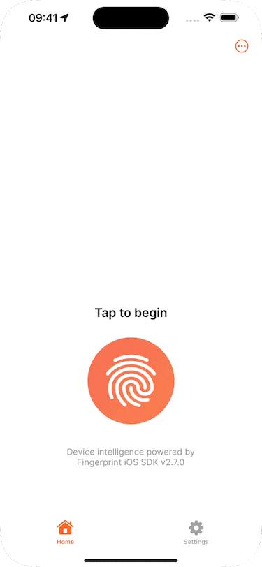
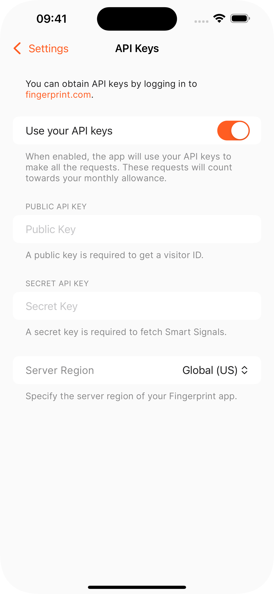

<p align="center">
  <a href="https://fingerprint.com">
    <picture>
      <source media="(prefers-color-scheme: dark)" srcset="resources/logo_light.svg" />
      <source media="(prefers-color-scheme: light)" srcset="resources/logo_dark.svg" />
      
    </picture>
  </a>
</p>

<p align="center">
  <a href="https://developer.apple.com/xcode/">
    
  </a>
  <a href="https://www.swift.org/download/">
    
  </a>
  <a href="https://www.apple.com/ios/">
    
  </a>
  <a href="https://github.com/fingerprintjs/fingerprintjs-pro-ios/releases/tag/2.4.0">
    
  </a>
  <a href="https://developer.apple.com/documentation/swiftui/">
    
  </a>
  <a href="https://www.swift.org/documentation/package-manager/">
    
  </a>
</p>

<p align="center">
  <a href="https://discord.gg/39EpE2neBg">
    
  </a>
</p>

[Fingerprint’s Device Intelligence platform for iOS](https://dev.fingerprint.com/docs/ios) helps you to accurately identify the devices on which your mobile app is being used. The platform also provides high-quality [Smart Signals](https://dev.fingerprint.com/docs/smart-signals-overview#smart-signals-for-mobile-devices) that will help you identify risky transactions before they happen. The Fingerprint Pro Demo App for iOS allows you to effortlessly experience the capabilities of our device intelligence platform.

## Fingerprint Pro Demo App in the App Store

[](https://apps.apple.com/us/app/fingerprint-pro/id1644105278)

<section>
  
  
  
  
</section>

---

# About

This repository contains the source code for the Fingerprint Pro Demo App for iOS. It shall serve as a good example

- For integrating the Fingerprint Identification SDK in your iOS app;
- For best practices to follow when using the Fingerprint Identification SDK in your app;
- For creating a [privacy manifest file](https://dev.fingerprint.com/docs/mobile-devices-understanding-privacy-manifest-files) for your app.

# Getting Started

Get the app up and running in a few simple steps:

1. Clone the repository:
    ```sh
    git clone https://github.com/fingerprintjs/fingerprint-device-intelligence-ios-demo.git
    cd fingerprint-device-intelligence-ios-demo
    ```

2. Set up the development environment:
    ```sh
    make environment
    ```

> [!NOTE]
> In line with the shift-left security approach, the installed pre-commit hook uses [gitleaks](https://github.com/gitleaks/gitleaks) to prevent your API keys from being inadvertently committed to the repository.

3. Open the Xcode project (`FingerprintProDemo.xcodeproj`):
    ```sh
    xed .
    ```

4. Open up the `FingerprintProDemo/Config/ConfigVariable.swift` file (`⇧ + ⌘ + O` to Open Quickly) and assign your Public API Key + [Region](https://dev.fingerprint.com/docs/ios-sdk#region) to `Developer.apiKey` and `Developer.region` static fields respectively. You can find the API key in your [dashboard](https://dashboard.fingerprint.com/) at `App Settings` > `API Keys`.

5. Go to `FingerprintProDemo` target settings, click *Signing & Capabilities*, and select your development team. 

6. Build and run the app on the selected simulated or real device (`⌘ + R`).

# Fingerprint Identification SDK

Following up on the information provided in our [Getting Started Guide](https://dev.fingerprint.com/docs/ios-sdk), you might refer to this repository for an example of:

## Getting the response

The SDK configuration code and `getVisitorIdResponse()` call are abstracted away by the `DeviceIdentificationService<ClientFactory>` struct (see [FingerprintProDemo/Domain/Services/DeviceIdentification](./FingerprintProDemo/Domain/Services/DeviceIdentification)), a concrete implementation of the `DeviceIdentificationServiceProtocol` protocol. While creating such an abstraction layer is not mandatory, it is a good practice that improves code maintainability and testability.

## Examining the response

The `DeviceIdentificationService<ClientFactory>.fingerprintDevice()` method is called by the `DeviceFingerprintViewModel`, which further passes the obtained `FingerprintResponse` instance to the `ClientResponseEventViewModel`. This is where the individual field values are being extracted from the response and prepared for presentation inside the `EventDetailsView<Presentation, Actions>`. The view models can be found in [FingerprintProDemo/Features/Home/ViewModel](./FingerprintProDemo/Features/Home/ViewModel).

## Stubbing the response for SwiftUI previews and/or testing

To make the most out of [SwiftUI previews in Xcode](https://developer.apple.com/documentation/swiftui/previews-in-xcode), you should have full control over the data that describes the view's state. See [FingerprintProDemo/PreviewContent](./FingerprintProDemo/PreviewContent) for an example of how you can create and use a stubbed `FingerprintResponse` for your previews. Likewise, the same technique can be used for writing the automated tests.

# License

The source code in this repository is licensed under the [MIT license](LICENSE).
